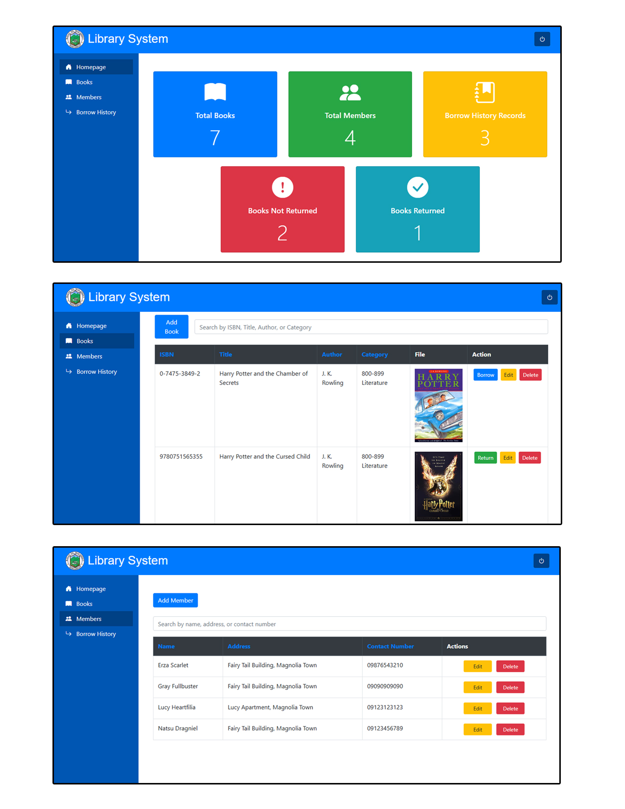

# Library System

## Admin

-   **Host**: [http://127.0.0.1:8000/](http://127.0.0.1:8000/)
-   **Email**: `admin@library.com`
-   **Password**: `admin`

## Member

-   **Host**: [http://127.0.0.1:8000/loginMember](http://127.0.0.1:8000/loginMember)
